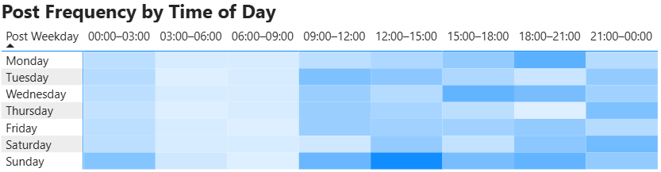
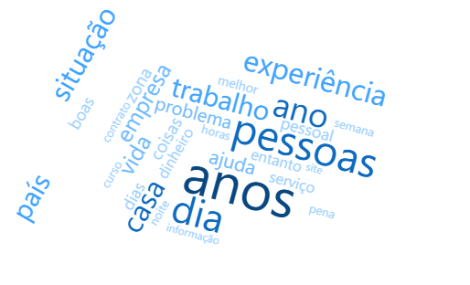
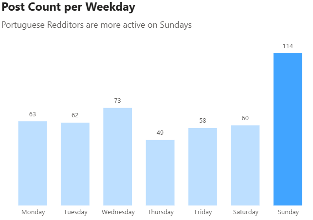
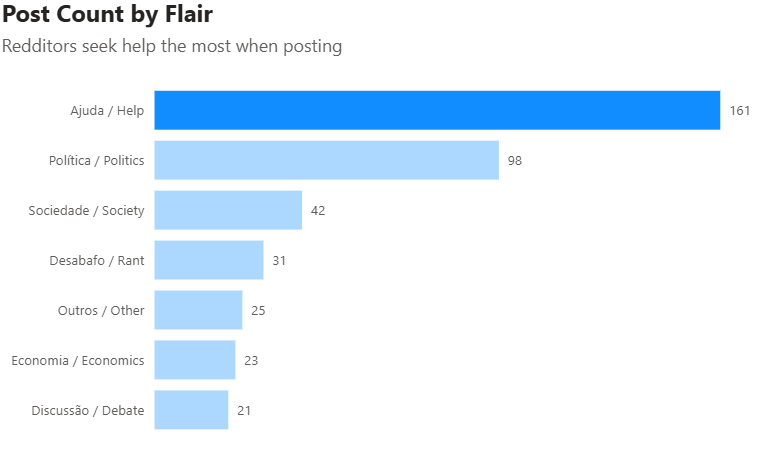

# Reddit Post Data Analysis – Portuguese Subreddit

## Project Introduction

This project focuses on analyzing Reddit posts from the Portuguese subreddit. It includes data extraction, storage, feature engineering, and visualization, with the aim of understanding posting trends and exploring predictive modeling.

---

## Project Structure

The project is structured using **object-oriented programming** to promote clarity and modularity.

### 1. Data Extraction

- **Files**: `extractor.py`, `db.py`
- **Description**: 
  - Connects to the Reddit API to extract post data.
  - Stores the data in an **SQLite** database.
- **Database fields** include:
  - Post title
  - Post date
  - Text content
  - Number of comments
  - Upvotes
  - Post flair
  - Other relevant metadata

---

### 2. Data Refresh

- **File**: `refresh.py`
- **Description**:
  - Updates upvote and comment data.
  - Focuses on the past two days, as most posts lose traction after this period.

---

### 3. Feature Engineering & Analysis

- **File**: `analyzer.py`
- **Description**:
  - Generates additional features such as:
    - Upvote-to-comment ratio
    - Sentiment analysis
    - Top keywords
  - Uses libraries like `pandas`, `spaCy`, and other NLP tools.

---

## Database Output

The SQLite database consists of three tables:

- `posts`: Original post data
- `features`: Engineered features
- `top_keywords`: Extracted keywords per post

---

## Visualization

- Visualizations are being built using **Power BI** for exploratory data analysis.
- Main goals:
  - Identify posting patterns
  - Discover trends by flair, sentiment, or time
  - Understand engagement metrics

### Example of Current Visualizations

- Post Frequency by Time of Day - Heatmap

As expected, users post more in the afternoon/evening. There are very few posts between 3 and 9am.

- Top Keywords - Word Cloud

The most frequent word is "anos". Work related words are also very frequent.

- Post Count per Weekday

- Post Count by Flair

---

## Future Work

Planned enhancements include:

- **POWER BI Dashboard**:
  - Further development of the Dashboard

- **Hypothesis Testing**:
  - Are longer posts more popular?
  - Do posts with positive sentiment get more upvotes?

- **Clustering**:
  - Group similar posts using NLP-based techniques

- **Predictive Modeling**:
  - Predict post popularity
  - Classify post types based on content and metadata

---

## Technologies Used

- Python (OOP structure)
- Reddit API (`PRAW`)
- SQLite
- Pandas, spaCy, and other NLP libraries
- Power BI

---

## Work in Progress

This project is actively under development and open to improvements, feedback, and additional features.